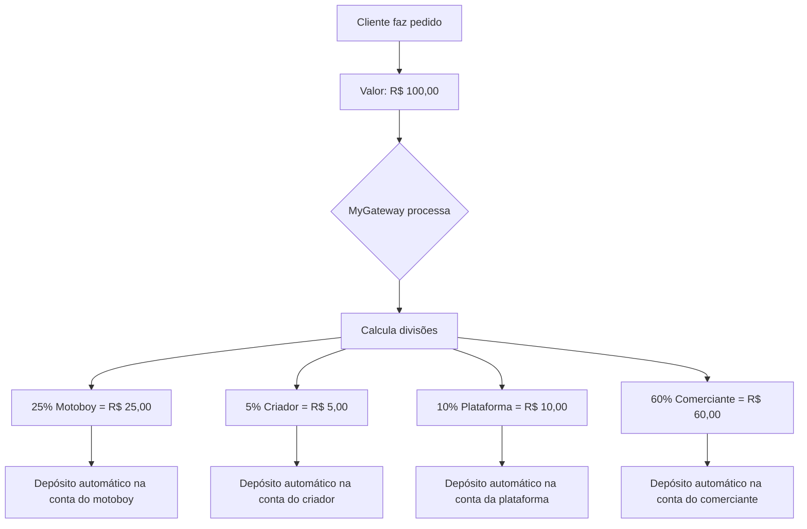

# 💰 DIVISÃO AUTOMÁTICA DE PAGAMENTOS - MYGATEWAY

## ✅ CONFIGURAÇÃO ATUALIZADA

### 📊 PORCENTAGENS DE DIVISÃO

```
💰 VALOR TOTAL DO PEDIDO (100%)
├── 🏍️ Motoboy: 25%
├── 👨‍💻 Criador: 5%
├── 💎 Plataforma: 10%
└── 🏪 Comerciante: 60% (restante)
```

---

## 🔄 COMO FUNCIONA A DIVISÃO AUTOMÁTICA

### 1️⃣ **Cliente Finaliza Pedido**
- Valor: R$ 100,00
- Método: PIX ou Cartão

### 2️⃣ **MyGateway Processa Pagamento**
```javascript
[MyGateway] Divisão do pagamento:
  💰 Total: R$ 100.00
  🏍️ Motoboy (25%): R$ 25.00
  👨‍💻 Criador (5%): R$ 5.00
  💎 Plataforma (10%): R$ 10.00
  🏪 Comerciante: R$ 60.00
```

### 3️⃣ **Distribuição Automática**
Cada participante recebe **automaticamente** na conta bancária cadastrada:

| Participante | Porcentagem | Valor (exemplo R$100) | Recebe em |
|--------------|-------------|----------------------|-----------|
| 🏍️ Motoboy | 25% | R$ 25,00 | Conta bancária |
| 👨‍💻 Criador | 5% | R$ 5,00 | Conta bancária |
| 💎 Plataforma | 10% | R$ 10,00 | Conta bancária |
| 🏪 Comerciante | 60% | R$ 60,00 | Conta bancária |

---

## 🏦 CONTAS BANCÁRIAS NECESSÁRIAS

### ✅ **OBRIGATÓRIO PARA TODOS:**

1. **Motoboy** → Deve cadastrar:
   - Banco
   - Agência
   - Conta Corrente
   - Chave PIX (opcional)

2. **Criador/Admin** → Deve cadastrar:
   - Banco
   - Agência
   - Conta Corrente
   - Tipo de Conta

3. **Comerciante** → Deve cadastrar:
   - Banco
   - Agência
   - Conta Corrente
   - CNPJ

---

## 🚀 IMPLEMENTAÇÃO TÉCNICA

### Arquivos Modificados:

#### 1. **mygateway-integration.js**
```javascript
// Configuração das porcentagens
this.motoboyPercent = 25;  // 25% para motoboy
this.creatorPercent = 5;   // 5% para criador
this.plataformaPercent = 10; // 10% para plataforma
```

#### 2. **Funções Adicionadas:**
```javascript
// Criar conta do criador
async criarContaCriador(dadosCriador) {
    // Cria conta no MyGateway
    // Retorna creatorId
}

// Processar pagamento com split
async processarPagamento(pedido) {
    // Calcula divisões automaticamente
    // Envia para MyGateway
    // Cada um recebe sua parte
}
```

---

## 📋 FLUXO COMPLETO



---

## ✅ VANTAGENS

### 🎯 **Automático**
- Sem necessidade de transferência manual
- Cada um recebe direto na conta
- Processo transparente

### 💸 **Seguro**
- MyGateway gerencia as divisões
- Cumprimento de regulamentações
- Rastreabilidade completa

### ⚡ **Rápido**
- Pagamento instantâneo
- Distribuição automática
- Sem atrasos

### 📊 **Transparente**
- Todos sabem quanto vão receber
- Logs detalhados no console
- Extrato individual

---

## 🔧 CONFIGURAÇÃO NECESSÁRIA

### Passo 1: Cadastrar Dados Bancários
Todos os participantes devem cadastrar:
- Código do banco
- Agência
- Conta corrente
- Tipo de conta

### Passo 2: Criar Contas no MyGateway
```javascript
// Criar conta do comerciante
await myGateway.criarContaComerciante(dados);

// Criar conta do motoboy
await myGateway.criarContaMotoboy(dados);

// Criar conta do criador
await myGateway.criarContaCriador(dados);
```

### Passo 3: Processar Pedidos
```javascript
// Ao finalizar pedido
const resultado = await myGateway.processarPagamento(pedido);

// Automaticamente divide entre:
// - Motoboy (25%)
// - Criador (5%)
// - Plataforma (10%)
// - Comerciante (60%)
```

---

## 📊 EXEMPLO PRÁTICO

### Pedido de R$ 150,00:

```
💰 Total: R$ 150,00

🏍️ Motoboy:
   25% = R$ 37,50
   → Recebe na conta bancária

👨‍💻 Criador:
   5% = R$ 7,50
   → Recebe na conta bancária

💎 Plataforma:
   10% = R$ 15,00
   → Recebe na conta bancária

🏪 Comerciante:
   60% = R$ 90,00
   → Recebe na conta bancária
```

---

## 🎯 RESUMO FINAL

✅ **Motoboy recebe 25%** automaticamente  
✅ **Criador recebe 5%** automaticamente  
✅ **Plataforma recebe 10%** automaticamente  
✅ **Comerciante recebe 60%** automaticamente  

**TUDO AUTOMÁTICO SEM PRECISAR FAZER NADA!** 🚀

---

## 💡 NOTAS IMPORTANTES

1. **Cadastro Obrigatório**: Todos precisam ter dados bancários válidos
2. **Validação Automática**: Sistema valida antes de processar
3. **Logs Detalhados**: Console mostra todas as divisões
4. **Segurança**: MyGateway garante conformidade

---

**STATUS:** ✅ SISTEMA DE DIVISÃO AUTOMÁTICA IMPLEMENTADO
