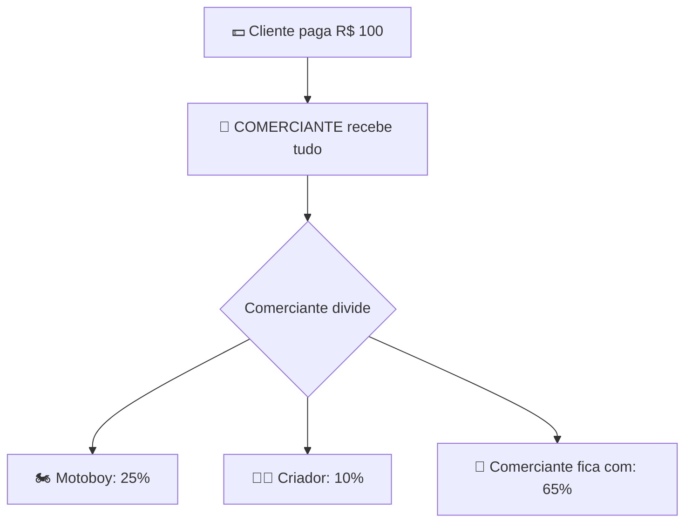

# 💰 DIVISÃO CORRETA - COMERCIANTE RECEBE E DIVIDE

## ✅ CONFIGURAÇÃO FINAL CORRETA

### 📊 QUEM É QUEM:

```
🏪 COMERCIANTE (Admin) = Quem vende os produtos
👨‍💻 CRIADOR = Dono da plataforma (sistema)
🏍️ MOTOBOY = Quem faz a entrega
```

---

### 💵 FLUXO DO DINHEIRO:



---

### 📋 PORCENTAGENS CORRETAS:

| Quem | Porcentagem | Valor (exemplo R$100) |
|------|-------------|----------------------|
| 🏪 **COMERCIANTE** | **65%** | **R$ 65,00** |
| 🏍️ Motoboy | 25% | R$ 25,00 |
| 👨‍💻 Criador | 10% | R$ 10,00 |

**TOTAL: 100% = R$ 100,00**

---

## 🔄 COMO FUNCIONA:

### Passo 1: Cliente Paga
```
Cliente finaliza pedido de R$ 100,00
↓
DINHEIRO VAI PARA O COMERCIANTE (ADMIN)
```

### Passo 2: MyGateway Divide Automaticamente
```
🏪 COMERCIANTE recebe R$ 100,00
↓
Automaticamente separa:
- 🏍️ R$ 25,00 para Motoboy (25%)
- 👨‍💻 R$ 10,00 para Criador (10%)
- 🏪 Fica com R$ 65,00 (65%)
```

### Passo 3: Cada Um Recebe na Conta
```
🏍️ Motoboy → R$ 25,00 na conta bancária
👨‍💻 Criador → R$ 10,00 na conta bancária
🏪 Comerciante → R$ 65,00 na conta bancária
```

---

## 💡 EXEMPLO PRÁTICO:

### Pedido de R$ 150,00:

```
💵 CLIENTE PAGA: R$ 150,00

🏪 COMERCIANTE RECEBE E DIVIDE:

🏍️ Motoboy (25%):
   R$ 37,50 → Vai para conta do motoboy

👨‍💻 Criador (10%):
   R$ 15,00 → Vai para conta do criador

🏪 Comerciante (65%):
   R$ 97,50 → Fica com comerciante
```

---

## 🔧 IMPLEMENTAÇÃO TÉCNICA:

### mygateway-integration.js:

```javascript
constructor() {
    this.merchantId = null;     // COMERCIANTE/Admin
    this.motoboyId = null;      // Motoboy
    this.creatorId = null;      // Criador
    
    this.plataformaPercent = 10; // 10% Criador
    this.motoboyPercent = 25;    // 25% Motoboy
    // COMERCIANTE: 65% (100 - 10 - 25)
}
```

### processarPagamento():

```javascript
// COMERCIANTE é quem processa o pagamento
const paymentData = {
    merchantId: this.merchantId, // COMERCIANTE
    amount: valorTotal,
    splits: [
        { accountId: motoboyId, value: 25% },
        { accountId: creatorId, value: 10% }
        // COMERCIANTE fica com resto automaticamente
    ]
};
```

---

## 🎯 RESUMO FINAL:

✅ **COMERCIANTE/Admin** recebe valor TOTAL do cliente  
✅ **COMERCIANTE** divide automaticamente  
✅ **Motoboy** recebe 25% do comerciante  
✅ **Criador** recebe 10% do comerciante  
✅ **COMERCIANTE** fica com 65%  

---

## 📊 LOGS NO CONSOLE:

```
[MyGateway] 🏪 COMERCIANTE vai receber e dividir...
[MyGateway] 💰 DIVISÃO DO COMERCIANTE:
  💵 Cliente pagou: R$ 100.00
  🏪 COMERCIANTE recebe: R$ 65.00 (65%)
  🏍️ Motoboy recebe: R$ 25.00 (25%)
  👨‍💻 Criador recebe: R$ 10.00 (10%)
```

---

## ✅ STATUS: CORRETO AGORA!

**COMERCIANTE recebe total e divide com motoboy e criador!** 🎉
